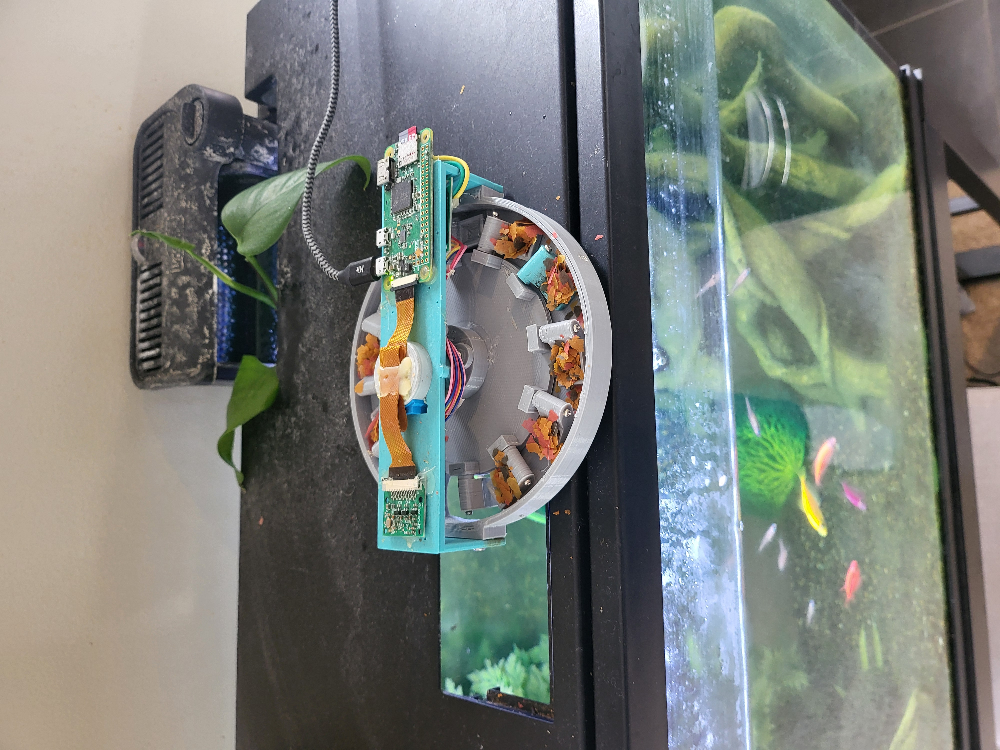
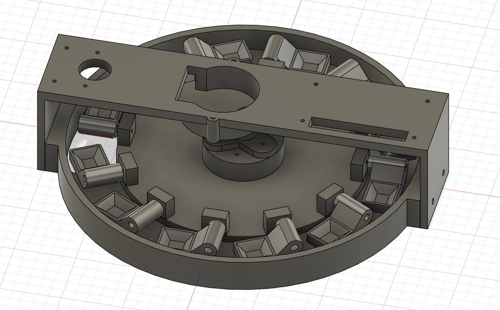
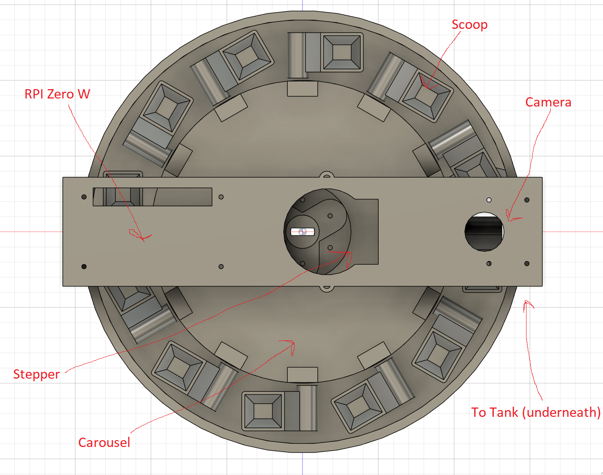

# Fish Feeder

An automated fish feeding system controlled by a Raspberry Pi, featuring a 12-station carousel mechanism with video recording capabilities.

## Table of Contents

- [Overview](#overview)
- [Hardware Requirements](#hardware-requirements)
- [Software Requirements](#software-requirements)
- [Installation](#installation)
- [Configuration](#configuration)
- [API Documentation](#api-documentation)
- [Usage](#usage)
- [Systemd Service](#systemd-service)

## Overview

This project is a quick weekend project that implements an automated fish feeder using a Raspberry Pi to control a stepper motor-driven carousel. The system features:

- 12-station carousel for pre-loaded food portions
- Web interface for manual and automated feeding
- Automatic video recording during feeding events so they can be verified by the user
- Video archive with downloadable recordings

## Hardware Requirements

- Raspberry Pi (tested with Raspberry Pi with camera support)
- 28BYJ-48 stepper motor with ULN2003 driver board
- Raspberry Pi Camera Module (compatible with Picamera2)
- Carousel mechanism with 12 feeding stations (see `stl/` directory).
- Command strips for attaching the feeder to the tank top.

### GPIO Pin Configuration

The stepper motor uses the following GPIO pins (BCM numbering):
- IN1: GPIO 6
- IN2: GPIO 13
- IN3: GPIO 19
- IN4: GPIO 26

## Software Requirements

- Python 3
- Flask
- RPi.GPIO
- Picamera2
- Operating System: Raspberry Pi OS (or compatible Linux distribution)

### Python Dependencies

Install required packages:

```bash
pip3 install flask RPi.GPIO picamera2
```

## Installation

1. Clone the repository to your Raspberry Pi:
```bash
git clone <repository-url>
cd fish_feeder
```

2. Install Python dependencies:
```bash
pip3 install flask RPi.GPIO picamera2
```

3. Create the videos directory:
```bash
mkdir -p /home/pi/fish_feeder/videos
```

4. Ensure all Python scripts are executable:
```bash
chmod +x fish_feeder.py stepper.py
```

## Configuration

### Carousel Settings

The carousel configuration can be adjusted in `fish_feeder.py`:

- `STEPS_PER_REV = 4096` - Steps for full 360° rotation
- `STATIONS_PER_REV = 12` - Number of feeding stations on the carousel

### Stepper Motor Settings

Motor timing can be adjusted in `stepper.py`:

- `step_sleep = 0.0015` - Delay between steps (in seconds)

### Video Settings

Video recordings are configured as:
- Resolution: 640x480
- Format: MP4
- Feeding videos: ~18 seconds (4 seconds pre-feed + feeding motion + 14 seconds post-feed)
- Manual recordings: 60 seconds

## API Documentation

### Endpoints

#### `GET /`

**Description**: Main web interface for human users with feeding controls and video archive.

**Query Parameters**:
- These are called by buttons in the web interface.  There is no position feedback on the wheel, so you have to manually line up the first station manually.
- `mm` (optional): Manual move - advances carousel by 30 steps without recording
- `mmr` (optional): Manual move remote - advances carousel by 30 steps with video recording.  This one is so you can manually align it remotely.  I haven't had to use it, but it's possible the raspberry pi could loose power in the middle of a move or something.

**Response**: HTML page with controls and list of recorded videos

---

#### `GET /feed`

**Description**: Initiates a feeding cycle by advancing the carousel to the next station and recording video.  This is so it can be operated by another program (ie I call it with Home Assistant).

**Response**: Text string indicating steps moved, or "ALREADY FEEDING!" if operation in progress

**Behavior**:
- Advances carousel by one station (4096/12 = ~341 steps)
- Records video: 4 seconds before + feeding motion + 14 seconds after
- Video saved as `/home/pi/fish_feeder/videos/feeding-<timestamp>.mp4`
- Operation runs in background thread

---

#### `GET /load`

**Description**: Advances carousel to the next station for in-person manual food loading (no video recording).  I don't really use this.  It's easier to manually load each station without moving the carousel.

**Response**: HTML template confirming load operation

**Behavior**:
- Advances carousel by one station
- No video recording
- Used for loading food into carousel stations

---

#### `GET /record`

**Description**: Records a 60-second video without moving the carousel.  This is so you can check on your fish.  I've found it doesn't usually catch them, since they have to be directly under the camera.

**Response**: "RECORDING." or "RECORDING ALREADY STARTED."

**Behavior**:
- Records 64 seconds of video (60 seconds + 4 second buffer)
- Video saved as `/home/pi/fish_feeder/videos/recording-<timestamp>.mp4`
- Does not move carousel
- Operation runs in background thread

---

#### `GET /download/<filename>`

**Description**: Download a recorded video file.  Used in the web interface to view recorded videos in a browser.

**Parameters**:
- `filename` (path parameter): Name of the video file to download

**Response**: Video file download

**Example**: `GET /download/feeding-1673456789.mp4`

## Usage

### Starting the Application

Run the Flask application manually:
```bash
sudo python3 fish_feeder.py
```

The web interface will be available at `http://<raspberry-pi-ip>/`

NOTE: Use this on a local network only.  DO NOT expose to the internet.  It uses Flask's built-in web server which shouldn't me exposed to the internet.  `fish_feeder.py` can be modified and used with gunicorn or another WSGI HTTP Server.  If you need to access it remotely consider using SSH port forwarding (what I use), a VPN or tailscale.

### Web Interface Controls

- **FEED**: Trigger feeding cycle with video recording
- **advance for load**: Move to next station for loading food (no recording)
- **adjust +30**: Manual fine adjustment of carousel position (no recording)
- **adjust +30 [remote]**: Manual fine adjustment with video recording
- **Record Video**: Record 60-second video without feeding

### Video Archive

All recorded videos are listed on the main page with timestamps and type (feeding/recording). Click any entry to download the video.

## Systemd Service

`fish.service` is a systemd service that runs the app.  It will auto-restart on reboot or if the main app crashes for any reason. To use it: 

1. Copy the service file:
```bash
sudo cp fish.service /etc/systemd/system/
```

2. Reload systemd:
```bash
sudo systemctl daemon-reload
```

3. Enable the service:
```bash
sudo systemctl enable fish.service
```

4. Start the service:
```bash
sudo systemctl start fish.service
```

5. Check service status:
```bash
sudo systemctl status fish.service
```

5. View logs through journalctl for debugging:
```bash
sudo journalctl -u fish -e
```

## Project Structure

```
fish_feeder/
├── fish_feeder.py      # Main Flask application
├── stepper.py          # Stepper motor control module
├── vid_test.py         # Camera testing script
├── fish.service        # Systemd service configuration
├── templates/          # HTML templates
│   ├── page.html       # Main interface
│   ├── load.html       # Load confirmation page
│   ├── in_progress.html # Operation in progress page
│   └── status.html     # Status page
└── videos/             # Directory for recorded videos (created at runtime)
```
## Known Issues/Things to Improve
- After a few months (especially in the winter) mold can start to grow on the print since it's in the constant humidity from the water and there's food on it.  I might have to add a mechanism to move it away from the hole when it's not dropping food.
- The Raspberry Pi hangs off the side a bit.  My printer is too small to print an arch that would fit the Pi confortably.  You might have a bigger one and can design a better one.


## Gallery

### My Build 


### Overview


### Top View


